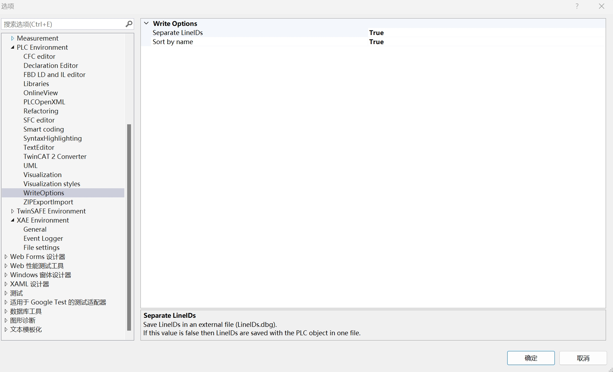
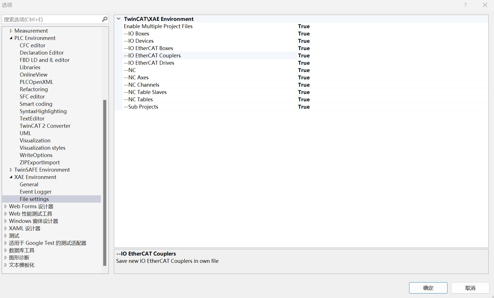
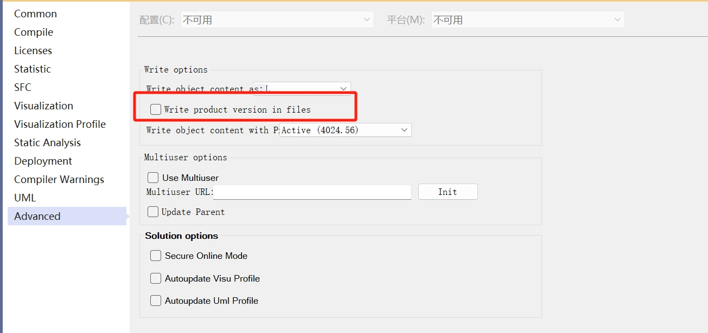

# Version Control Guide

## IDE中项目的设置

为了方便后续的Version Control，请在Visual Studio中完成以下设置：

1. `Tools -> Options -> TwinCAT -> PLC Environment -> WriteOptions -> Separate LineIDs`设为`True`；该设置可以将`.TcPOU`文件中有关`LineID`的内容全部存储到`LineID.dbg`文件中，提高`.TcPOU`的可读性；


2. `Tools -> Options -> TwinCAT -> XAE Environment -> File settings`中所有选项都设置为`True`；该设置可以将后续扫描的硬件信息都单独存储为一个文件，而不是存在`.tsproj`中；


3. 找到PLC项目(xxx Project)，右键选择`属性`，找到`Advanced`，取消勾选`Write product version in files`；该设置可以避免TwinCAT版本信息存储在每个`.TcPOU`文件中；


## Git项目的配置

### gitignore

许多项目生成的文件是不需要提交的，请参考 [.gitignore](../../.gitignore) 文件，以及其中的注释。


### filters

有些文件虽然需要提交，但其中包含了一些跟具体使用的工控机、环境相关的信息，这些信息我们不需要提交共享。
比如，`.tsproj`文件中存储了`TargetNetId`的信息，这个信息是每个开发者使用的工控机不同的，因此，`.tsproj`文件中关于该信息的变更我们不需要提交。

我们可以配置git的filters来忽略这些信息，具体操作如下：

1. 在项目的`.git/config`文件中添加以下内容:
    ```
    [filter "ignoreNetId"]
        clean = sh ".git/ignoreTargetNetId.sh"
    ```

2. 在`.gitattributes`文件中添加以下行:
    ```
    *.tsproj filter=ignoreNetId
    ```

3. 在`.git`文件夹中添加文件`ignoreTargetNetId.sh`:
    ```
    sed --regexp-extended "s/}\" TargetNetId=\"[0-9.]+\"/}\" /g" "$@"
    ```

## Code Formatter

### PLC: TcBlack
[TcBlack](https://github.com/Roald87/TcBlack)是一个PLC的代码格式化工具。

- 安装[TcBlack Releases](https://github.com/Roald87/TcBlack/releases)；更多code style，参考[本链接](https://github.com/Roald87/TcBlack/blob/master/docs/style.md)；

    1. 从[Releases](https://github.com/Roald87/TcBlack/releases)下载最新的Release或者直接clone仓库；
    2. 用VS打开`.sln`文件，点击`Build`生成解决方案；

- 找到`TcBlackCLI.exe`，然后使用: 
    `TcBlackCLI -p C:\Path\To\PlcProject.plcproj`；
    
#### 注意事项

- 例如声明变量，如果 `AT` 后面没有空格，那么 `Var_a  AT%I* : BOOL;`，格式化后会变为`Var_a AT AT%I* : BOOL;`，多出一个`AT`; 使用的时候，注意变量声明 `AT` 后应有一个空格；见 [issue](https://github.com/Roald87/TcBlack/issues/86)；
