# TwinCAT 开发环境搭建教程

## 安装教程

### 安装 Visual Studio 2019
请安装[Visual Studio 2019](https://visualstudio.microsoft.com/zh-hans/thank-you-downloading-visual-studio/?sku=Professional&rel=16)的任意版本，可以选择Community, Professional, Enterprise版本。
安装时，请勾选组件：`使用C++的桌面开发`：

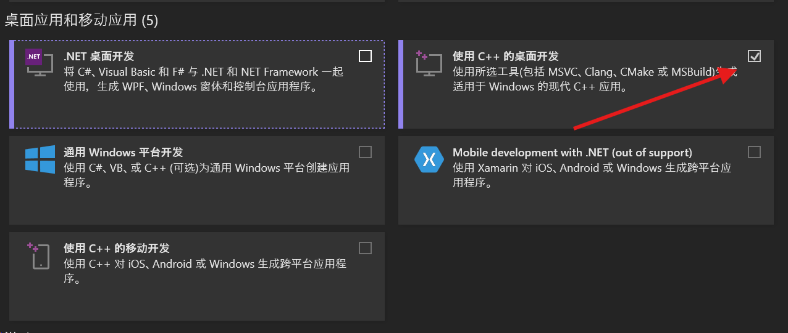

### 安装 TwinCAT 3 BUILD 4024.56
接着，[下载](https://tr.beckhoff.com.cn/mod/page/view.php?id=2287&inpopup=1)并执行TwinCAT 3 4024.56的安装程序，为了方便起见，建议执行完整安装：

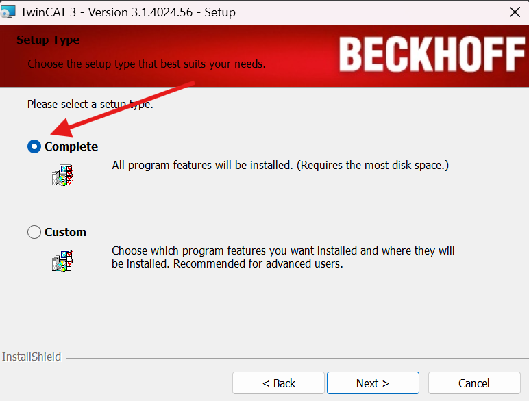

请确保相关与Visual Studio的集成选项被勾选：
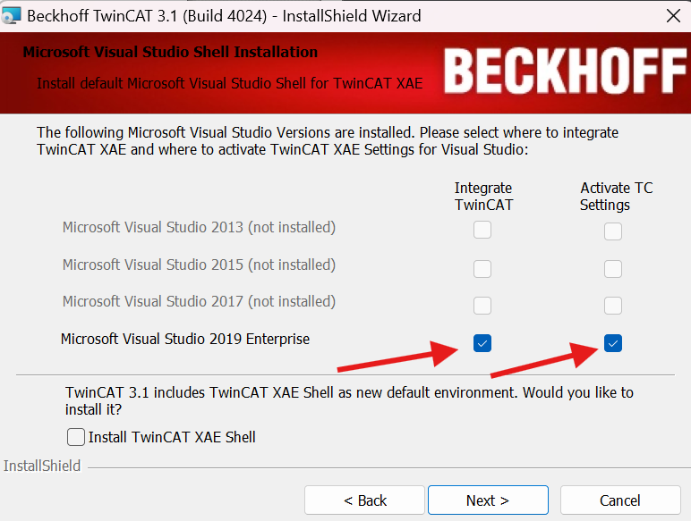

> 如果不小心先安装了TwinCAT 3，再安装Visual Studio 2019，可以通过重新运行TwinCAT安装程序并选择`修改/Modify`来安装Visual Studio的集成组件。

## 配置教程

### 配置C++运行所需证书（开发机器上配置）

#### 生成证书

请选择 扩展 -> TwinCAT -> 软件保护：
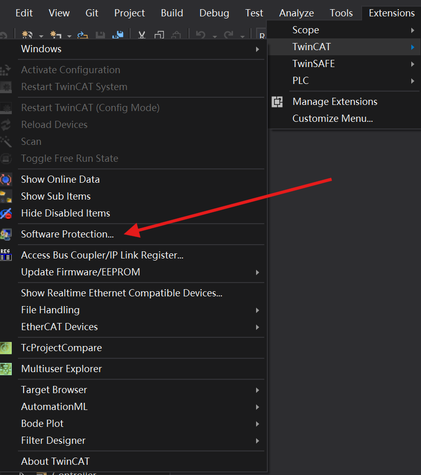

并在 `OEM证书` 部分点击 `创建新证书` 按钮，注意勾选 `Sign TwinCAT C++ executables` 选项并将 `Crypto Version` 切换到 `2`。

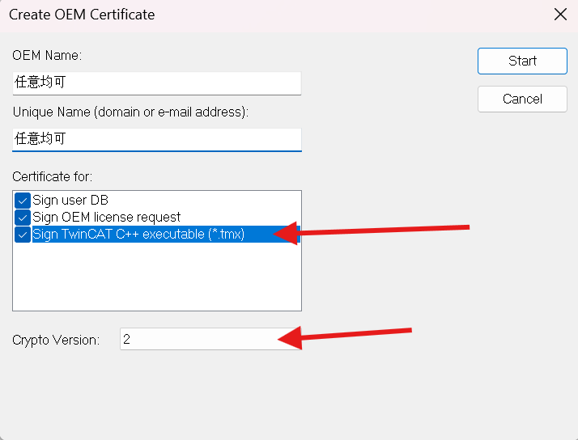

点击右上角的`Start`后输入两次密码，生成证书：

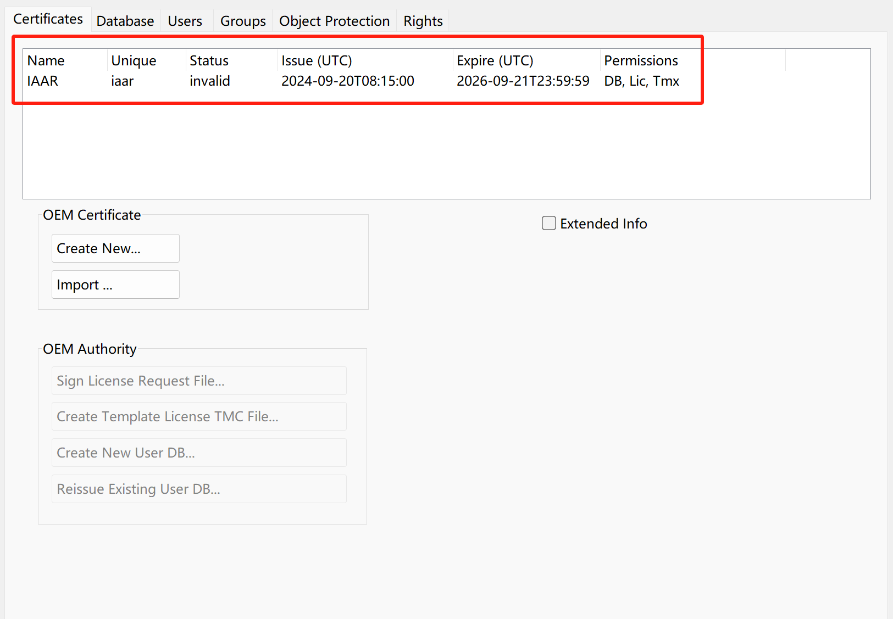

证书默认的保存路径如下：

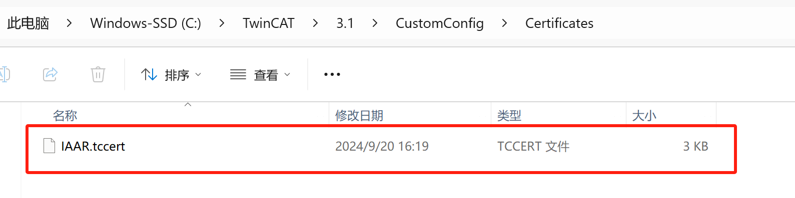

#### 使用证书签名C++程序
在C++中右键选择`添加新项`，选择`TwinCAT Versioned C++ Project`：
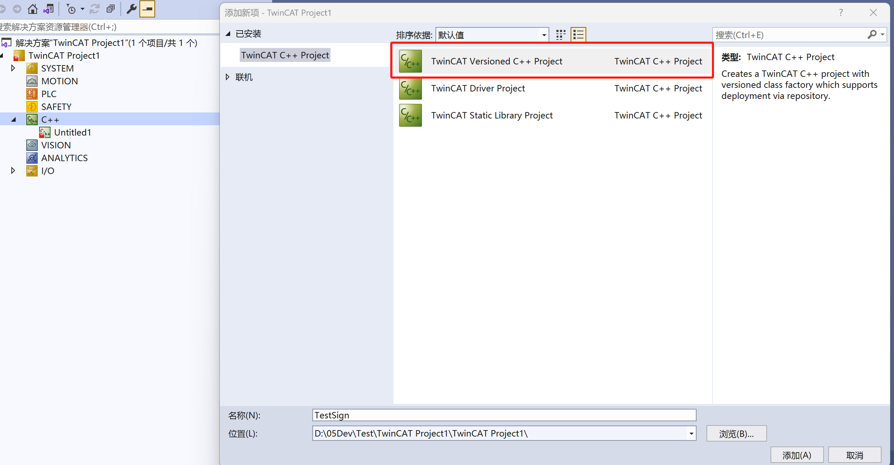

在C++项目的属性中，选择 `Tc Sign` 选项卡：
- 在签名部分，仅选择 `TwinCAT signing`
- 在证书部分，填入刚才的证书的`OEM Name`.tccert和密码
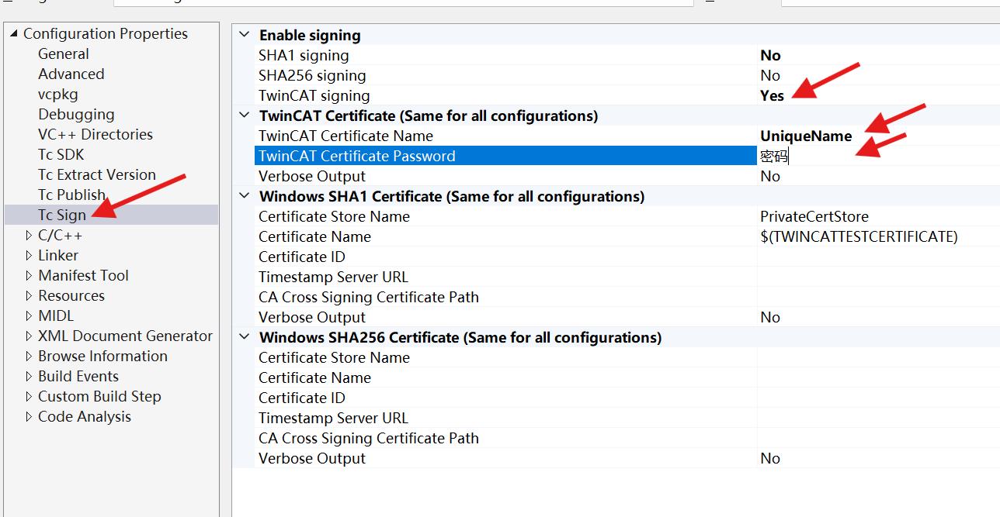

> 将密码保存在项目文件中是不安全的，请不要将密码提交到版本控制系统中。
> 可以使用工具[TcSignTool](https://infosys.beckhoff.com/english.php?content=../content/1033/tc3_c/6829815563.html&id=)来避免在项目里面输入密码。

### 配置TwinCAT运行时（运行机器上配置）

#### 激活操作系统的测试模式
在Target系统上，需要允许我们自定义的证书的运行。
- 在Windows上，执行：`bcdedit /set testsigning yes`，然后重启。重启后可以在系统中右下角看到 `Test Mode` 的标志。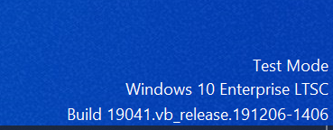
- 在FreeBSD操作系统上，参考[TC/BSD文档](https://infosys.beckhoff.com/english.php?content=../content/1033/tc3_c/831427979.html&id=436133641470301781)。

#### 信任我们自定义的证书
Build项目成功之后，下方的输出栏会显示属性栏中选用的证书：

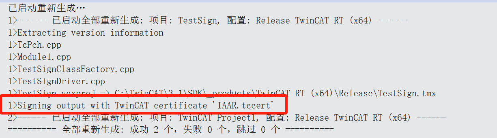

在第一次激活C++项目至Target系统的时候，会报错：

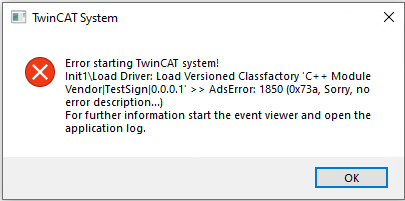

Target系统会提示我们需要在Target上添加我们的证书，请按照提示操作：

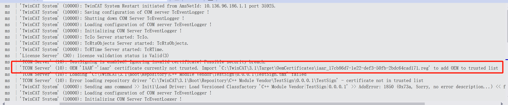

远程进入到Target系统，进入到该路径中，双击证书对应的`.reg`文件，选择`Yes`：

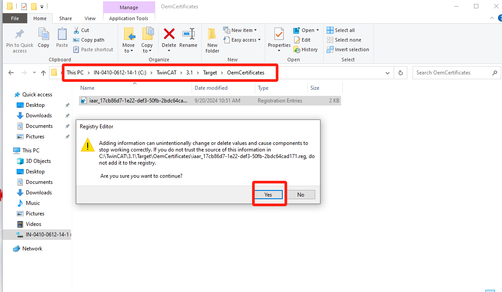

注册证书成功后显示如下，重新激活程序至Target系统：

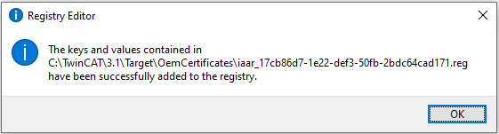
