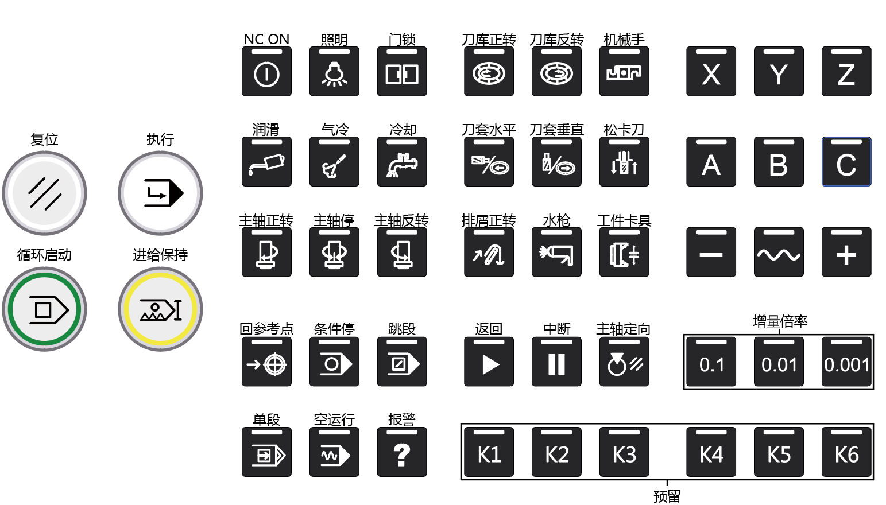
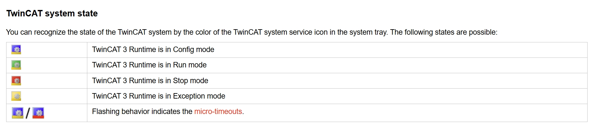
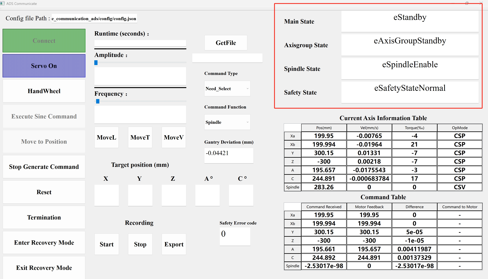
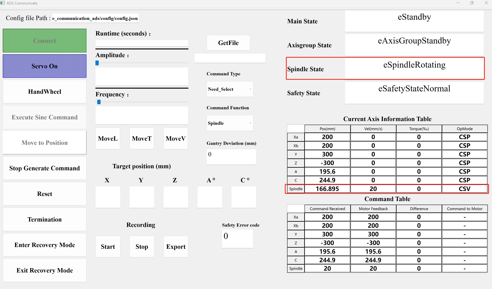
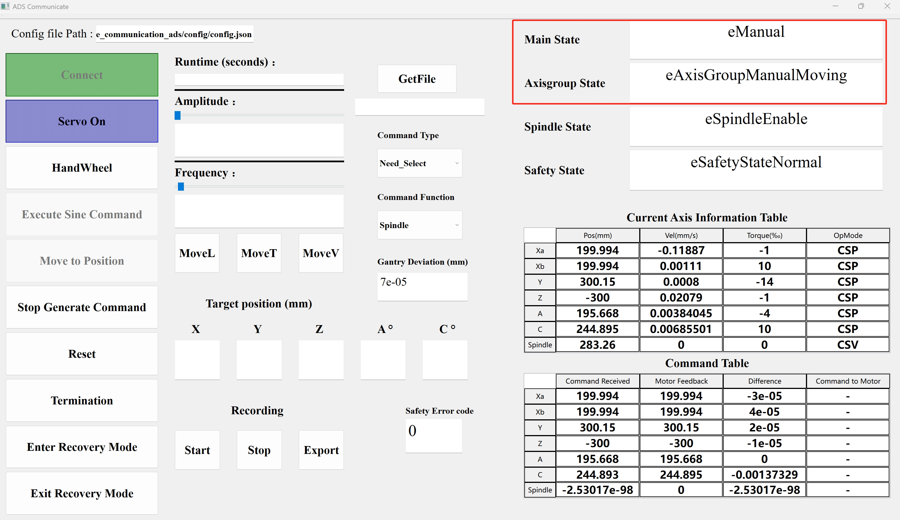
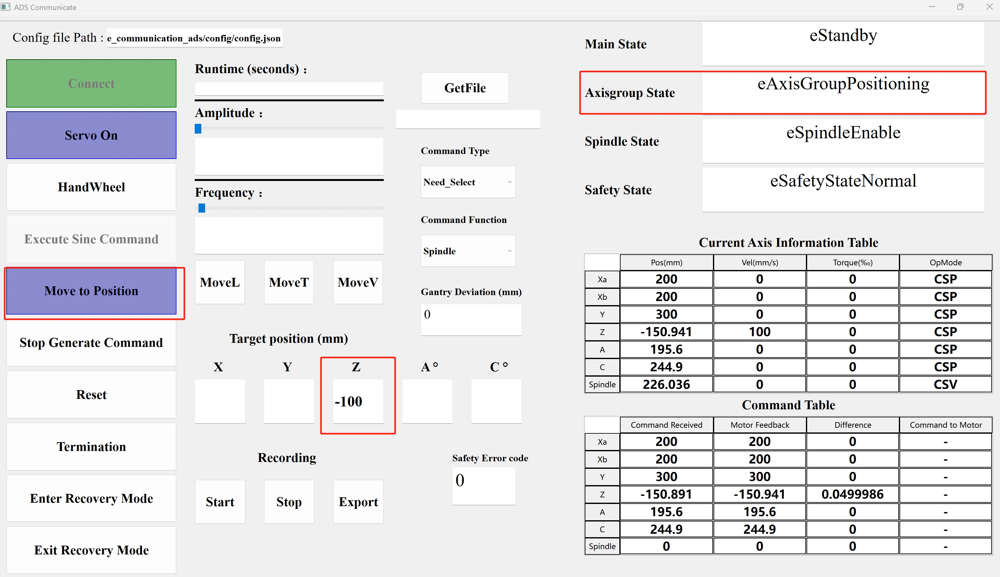
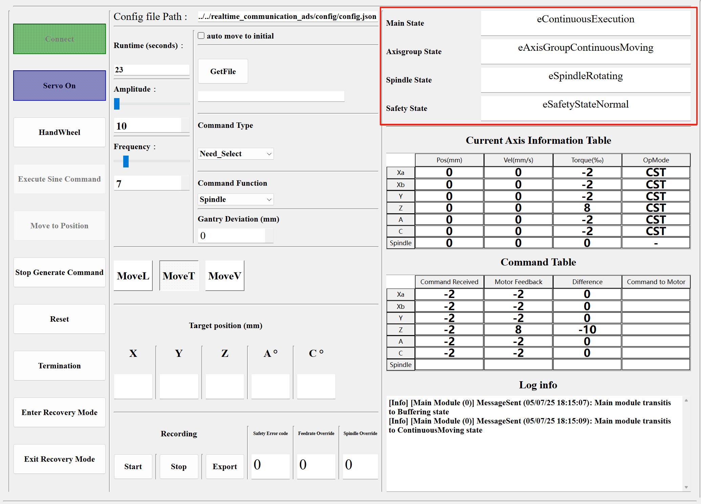
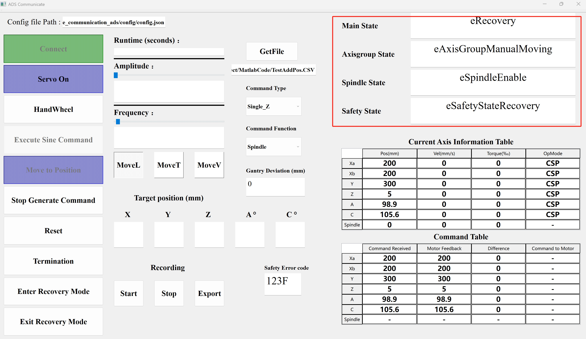
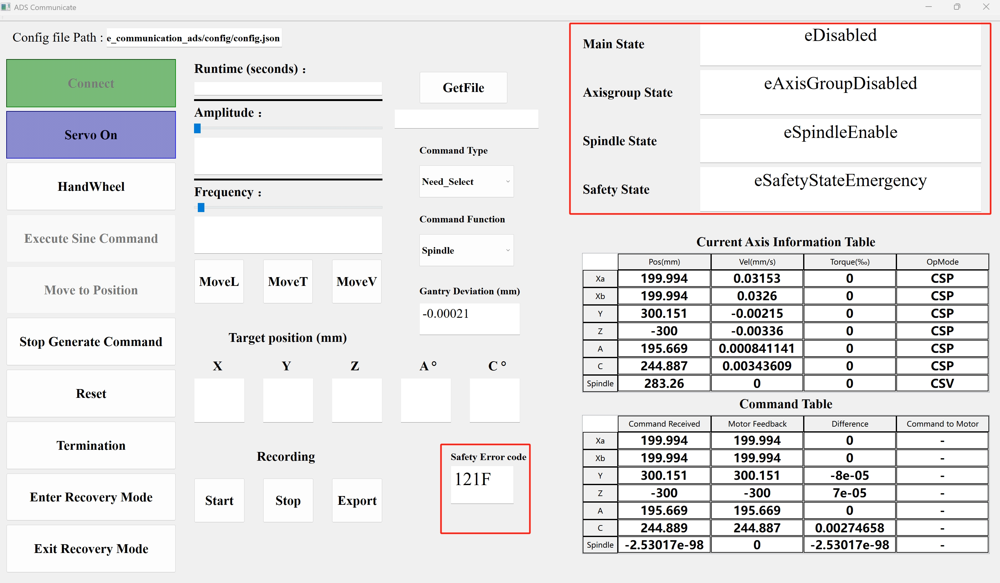
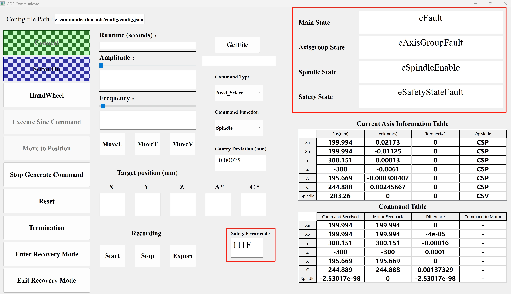

# 测试台架使用说明

本文档基于上位机的测试软件来展开操作说明，后续上位机的用户软件完善之后会对本文档进行对应的修改；

测试台架配备的是铣床按键面板，所以后续操作会参照下方的铣床按键说明逐一展开：

## 1. 激活工程至工控机

1-1. 生成解决方案后，激活工程至远程的工控机；若工控机上的TwinCAT图标为绿色，则说明工程激活成功且启动，此时面板上的`主轴停`指示灯也会亮起；

1-2. 测试软件左上角选择配置文件路径，点击测试软件左侧的`Connect`按钮，建立上下位机之间的通信；

若不想在机器上进行操作，可参考[HowToSimulate.md](../HowToSimulate/HowToSimulate.md)来实现硬件模拟，完成上位机的测试；

## 2. 电机上使能

2-1. 按下面板上的`NC ON`按钮，对应的指示灯亮起，测试软件右上角的四个状态会如下图所示：

2-2. 若要给电机下使能，再次按下面板上的`NC ON`按钮，对应的指示灯熄灭；

## 3. 主轴正反转

3-1. 按下面板上的`主轴正转`或`主轴反转`按钮，对应的指示灯亮起，`主轴停`的指示灯熄灭，`Spindle State`会跳转至`SpindleRotating`，主轴按照预设的转速
正反转，速度单位为rps；

3-2. 面板上按下`主轴停`按钮，对应的指示灯亮起，正转或反转的指示灯熄灭，主轴停转；

注：该状态只能在`Main State`为`Standby`的时候进入；

## 4. 加工轴手摇模式

4-1. 增量倍率中按下一个倍率，其指示灯亮起；

4-2. 按下面板上的`X\Y\Z\A\C`中的一个按钮，选择要操作的轴，对应的指示灯亮起；`Main State`跳转至`Manual`,`AxisGroup State`会跳转至`AxisGroupManualMoving`;
此时摇动面板上的手轮，手轮转动一格，若倍率为0.1，对应轴要运行的距离为0.1毫米或者0.1弧度，依此类推；

4-3. 运动结束后，再按下选中的轴按钮和倍率，退出手摇模式；

注：该状态只能在`Main State`为`Standby`的时候进入；

## 5. 加工轴定位模式

5-1. 测试软件上在对应轴下方的方框里输入每个轴的目标位置，不输入值即默认保持当前位置；

5-2. 点击左侧的`Move To Position`按钮，`AxisGroup State`会跳转至`AxisGroupPositioning`；
所有轴到达目标位置后，`AxisGroup State`会跳转至`AxisGroupStandby`；

注：该状态只能在`Main State`为`Standby`的时候进入；

## 6. 加工轴连续加工模式

通过测试软件使下位机进入加工模式有两种方式：

### 6-1. 使轴跑Sine曲线轨迹

6-1-1. 测试软件中`Runtime`下方输入运行轨迹的时间，设置运行时间是强制性的，避免了无限制的持续运动，如果不设置时间，测试软件将不生成运动指令，`Amplitude`滑动条选择Sine函数幅值，`Frequency`滑动条选择Sine函数频率；

6-1-2. `Comannd Type`中可以选择五轴联动或者单轴运动；

6-1-3. 选择`MoveL，MoveT，MoveV`中的一个按钮，其分别代表轴运行的模式为CSP，CST和CSV；

6-1-4. 按下测试软件的`Execute Sine Command`按钮和面板上的`执行`按钮，`Main State`先跳转至`Buffering`，待指令数量达到设置的个数，跳转至`ContinuousExecution`，
`AxisGroup State`会跳转至`AxisGroupContinuousMoving`，为了更真实地模拟实际情况，测试软件会在生成的指令中插入主轴控制指令，从而对主轴进行控制，因此`Spindle State`会跳转至`SpindleRotating`；

### 6-2. 使轴按预设轨迹及补偿进行运动

6-2-1. 测试软件中`Get File`选择要加载的[`.msgpack`](./msgpack.md)文件；

6-2-2. 下拉`Comannd Type`确定即将运动的轴，再选择运行模式(位置，力矩或速度)；

6-2-3. 按下`Execute Sine Command`按钮和面板上的`执行`按钮，对应的轴会按照文件中的数值进行运动；

注：若要从`6-2`模式切换回`6-1`并发送模拟指令，需要先删除`Get File`中的路径。否则，测试软件将默认执行`.CSV`文件中的指令，而不是模拟指令。

## 7. 异常分析

测试软件右上角的`Safety State`会表示下位机的异常状态，正常情况下会显示`Normal`，异常类型有`Fault`，`Emergency`和`Warning`，检查优先级从高到低；

测试软件中的`Safety Error Code`由四位16进制编码组成，表示下位机运行过程中的异常类型：

| 编码位置 | 含义 |
| :----: | :----: |
| 第一位 | 表示错误发生的模块，0：Main Module，1：AxisGroup Module，2：Spindle Module |
| 第二位 | 表示错误类型，0：系统错误，1：驱动器状态错误，2：超过位置正向限位，3：超过位置负向限位，4：超过速度限制，5：超过力矩限制，6：龙门轴偏差过大，7：力矩跟随误差超过限制，8：相邻力矩指令偏差超过限制|
| 第三位 | 表示发生错误的轴编号，1：X轴，2：Y轴，3：Z轴，4：A轴，5：C轴，6：主轴 |
| 第四位 | 目前仅显示`F`，预留位，后续扩展用 |

注：目前位置的软硬限位的错误编码未作区分，后续可以拆分；

### Warning状态

触发该异常后，主状态和加工轴状态会进入`Standby`，导致进入该状态的异常目前有如下几类：

1. 加工轴和主轴的速度超过限制；

恢复措施：

1. 点击测试软件中的`Enter Recovery Mode`按钮，系统会进入下图所示的`Recovery`状态：

2. 点击测试软件中的`Exit Recovery Mode`按钮，退出恢复模式，此时能看到错误码被清除；

### Emergency状态

触发该异常后，主状态和加工轴状态会进入`Disabled`，导致进入该状态的异常目前有如下几类：

1. 加工轴触发硬限位；
2. 龙门轴偏差过大；
3. 一段周期内，力矩指令跟随误差的平均值过大；
4. 一段周期内，相邻力矩指令变化的平均值过大；

示例：
错误码显示`121F`，则表示加工轴中的X轴的位置超过了位置正向限位；

恢复措施：

1. 按下面板上的`NC ON`按钮，给电机重新上使能；

2. 点击测试软件中的`Enter Recovery Mode`按钮，系统会进入`Recovery`状态：

3. 在面板上选择出错的轴和增量倍率，通过手摇将超限的轴移动至限位范围内；注：手摇的方向必须和触发的限位方向相反；

4. 点击测试软件中的`Exit Recovery Mode`按钮，退出恢复模式，此时能看到错误码被清除；

### Fault状态

触发该异常后，主状态和加工轴状态会进入`Fault`，导致进入该状态的异常目前有如下几类：

1. 加工轴或主轴的驱动器异常；

示例：
错误码显示`111F`，则表示X轴的驱动器异常；

恢复措施：

1. 按下面板上的`复位`按钮，清除驱动器的错误；

2. 若`Safety State`跳转至`Normal`，则说明错误清除成功，按下面板上的`NC ON`按钮，给电机重新上使能；
