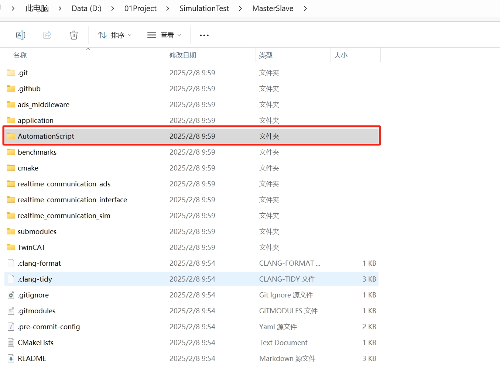
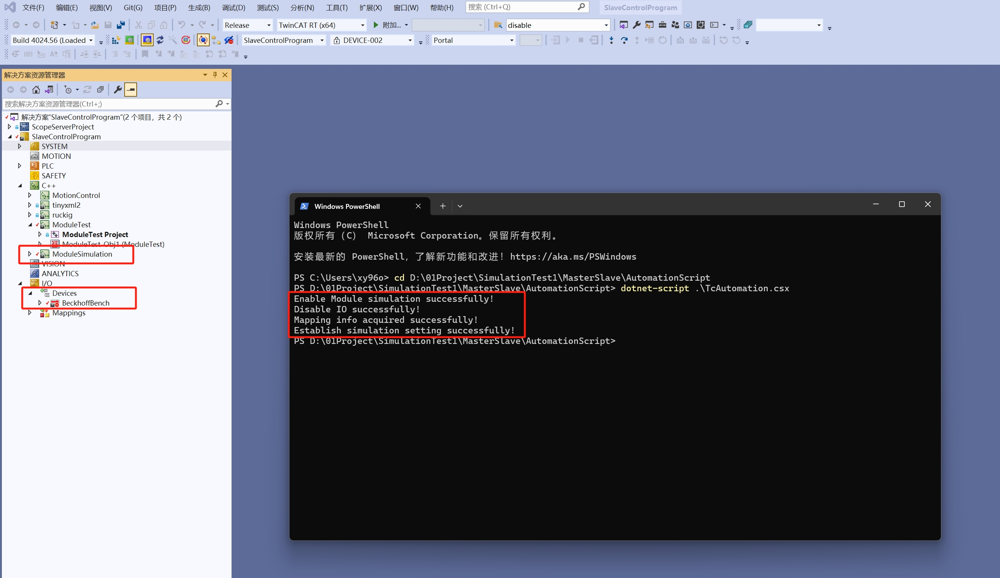
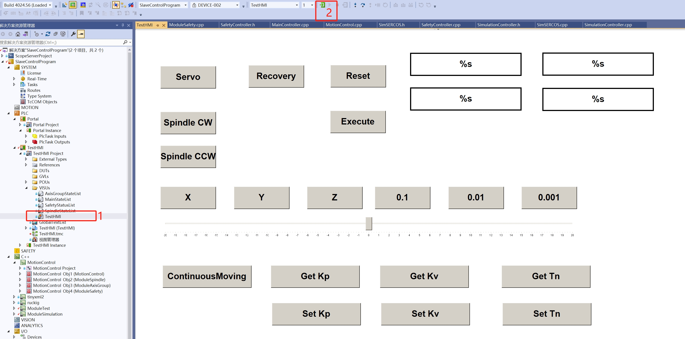
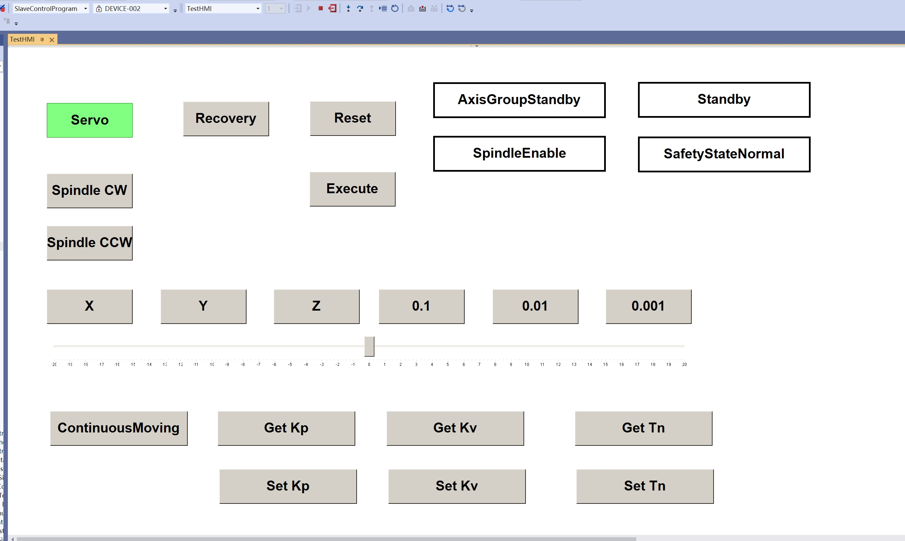
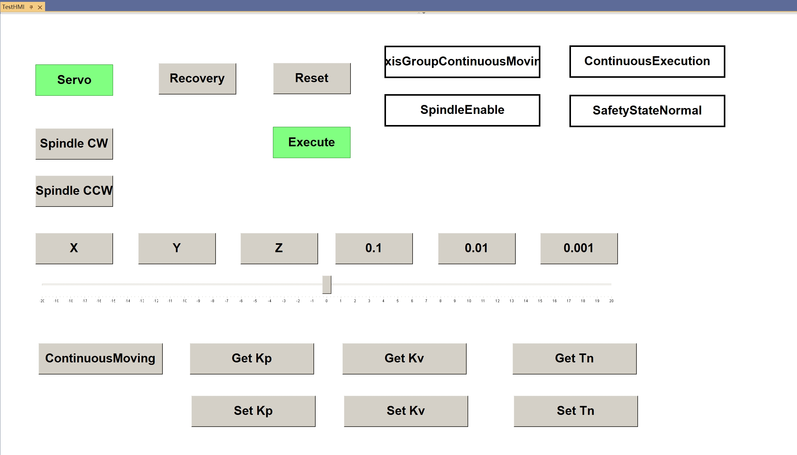
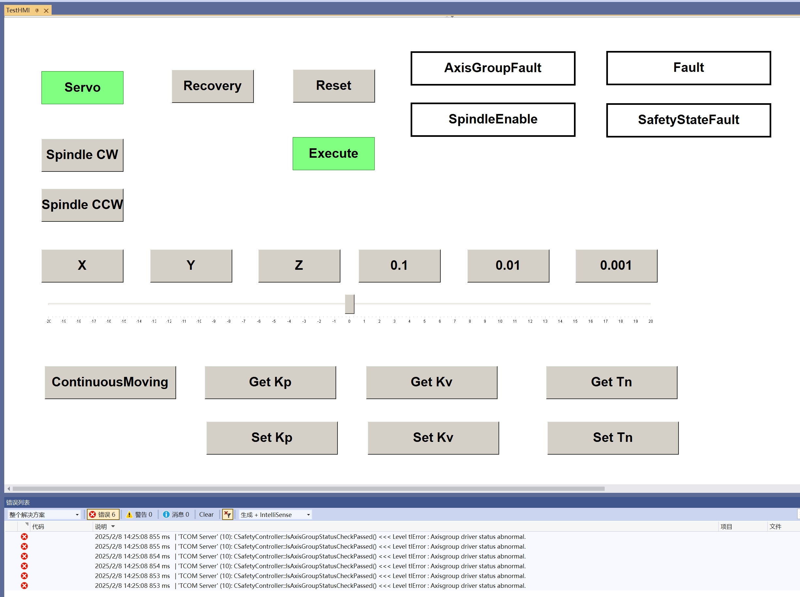
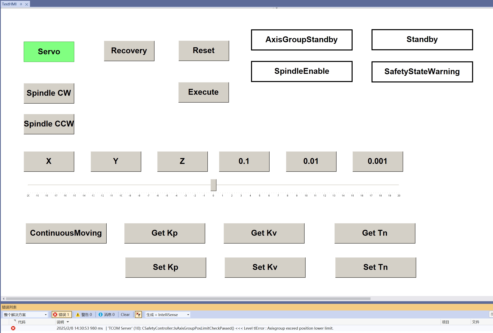

# TwinCAT工程模拟硬件配置

## 配置教程

### 1. 运行脚本

克隆完工程后，命令行导航到项目内`AutomationScript`文件夹，运行`TcAutomation.csx`脚本，运行脚本过程中Visual Studio会自动打开工程，脚本主要实现了启用Module Simulation，
禁用I/O硬件，建立模拟硬件状态下的变量链接；

### 2. 激活工程

生成解决方案后，激活工程至本地或者远程的工控机；PLC选项卡中找到`TestHMI`工程下的`VISUs`文件夹，双击打开`TestHMI`，点击上方选项栏的`登录`；

### 3. 使用教程

登录完成后，点击`Servo`按钮，给模拟电机上使能；主状态跳转至`Standby`；

若要进行运动指令的测试，还需在模拟电机使能后点击`Execute`按钮；主状态跳转至`ContinuousExecution`；

### 4. 问题排查

若在运动过程中，主状态跳转至`Fault`，则说明下发的相邻位置指令变化超过限幅，此时点击界面上的`Reset`按钮即可清错；

若在运动过程中，安全状态跳转至`SafetyStateWarning`，则说明轴的位置超过软限位限制，此时点击界面上的`Recovery`按钮进入`Recovery`状态；
选择轴和倍率，拖动滑动条将轴移动至软限位以内，再次点击`Recovery`按钮退出恢复状态，即可继续操作；

